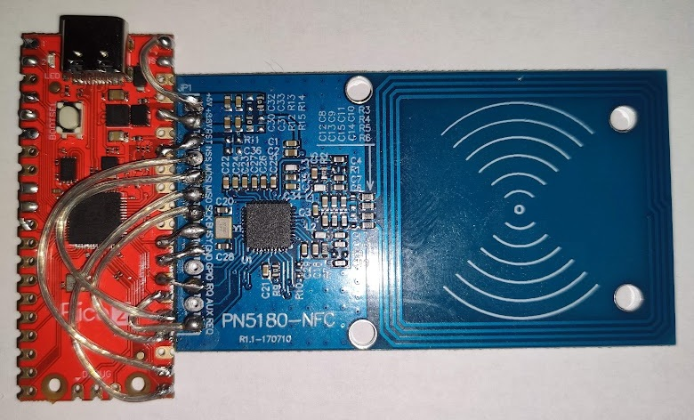

<!--
SPDX-FileCopyrightText: 2026 PN5180-tagomatic contributors
SPDX-License-Identifier: GPL-3.0-or-later
-->

# PN5180 RFID Reader Firmware

This directory contains the Arduino sketch for the Raspberry Pi Pico
firmware that interfaces with the NXP PN5180 NFC module.

## Hardware Requirements

- USB cable for connection to host computer
- Raspberry Pi Pico (the configured pins will then need to be modified) or a Raspberry Pi Pico Zero
- NXP PN5180 NFC Frontend Module card

My terrible prototype board:


Graylag's Pico2 board


## Printed case
I've made a simple 3D printable case for it
[here](https://www.printables.com/model/1545289-pn5180-tagomatic-case).
The OnShape model is linked from there.


The case is designed to mount on the backside of my Voron 2.4.
It should fit other printers with 2020 frames as well.

The lower lip can be cut off, and optionally the screw hole can be
filled, in the slicer and it can work as a simple,
freestanding case too.

## Pin Connections

| PN5180 Pin | Raspberry Pi Pico Zero Pin | Raspberry Pi Pico / Pico 2 |
|------------|----------------------------|----------------------------|
| MISO       | GP0 (SPI0 RX)              | GP16                       |
| NSS        | GP1                        | GP17                       |
| SCK        | GP2 (SPI0 SCK)             | GP18                       |
| MOSI       | GP3 (SPI0 TX)              | GP19                       |
| BUSY       | GP4                        | GP22                       |
| RST        | GP7                        | GP28                       |
| +3.3V      | 3.3V                       | 3.3V                       |
| +5V        | 5V                         | 5V                         |
| GND        | GND                        | GND                        |
| GPIO       | -                          | -                          |
| IRQ        | GP6                        | GP21                       |
| AUX        | -                          | -                          |
| REQ        | (GP9)                      | GP20                       |

The SPI interface is configured to run at 2 Mbps.
It might be too fast for some hardware (depending on the cables
etc). It is configured in the source code. It's possible to run
at lower speeds. I first ran it at 125000 bps.

The code doesn't use REQ yet and as seen from the photo,
I've not even connected the pin. It is used for firmware updates
of the PN5180. I've not implemented that, and I probably won't.


## Building and Uploading

### Prerequisites

The firmware requires the FastLED and SimpleRPC libraries.


### Using Arduino IDE

1. Install the Arduino IDE
2. Add following link to Additional Boards Manager: https://github.com/earlephilhower/arduino-pico/releases/download/global/package_rp2040_index.json
3. Add Raspberry Pi Pico board support:
   - Go to Tools > Board > Board Manager
   - Search for "pico" and install "Raspberry Pi Pico/RP2040/RP2350 by Earle F. Philhower, III" (version 5.5.0 was used).
4. Install the libraries:
  - Go to Sketch > Include Library > Manage Libraries
  - Search for the libraries and install them.
5. Press the select board pulldown: "Select Other Board and Port"
6. Search for pico, choose "Raspberry Pi Pico"
7. Select Port: Tools > Port > (your Pico's port)
8. Uncomment #define with your board type (hint, if you have Pico W, Pico 2 or Pico 2W, choose BOARD_PICO
9. Upload the sketch (the arrow)

### Using Arduino CLI

(Outdated!!!)
```bash
arduino-cli config init
arduino-cli core update-index
arduino-cli core install arduino:mbed_rp2040


# Install the libraries, see [Prerequisites]:
arduino-cli lib install FastLED
arduino-cli lib install simpleRPC

# Compile
arduino-cli compile -e --fqbn arduino:mbed_rp2040:pico sketch/pn5180_reader

# Upload (replace /dev/ttyACM0 with your port)
arduino-cli upload -p /dev/ttyACM0 --fqbn arduino:mbed_rp2040:pico sketch/pn5180_reader
# (or copy the uf2 file to the bootloader's drive)
```

## Protocol

The firmware communicates with the host computer over USB serial using the SimpleRPC protocol.

### Available Functions

See the code for their documentations or run:
```sh
simple_rpc list /dev/ttyACM0
```

### SimpleRPC

SimpleRPC is a simple RPC (Remote Procedure Call) protocol for Arduino
that allows Python programs to call Arduino functions over serial.
The API and protocol is documented at:
[https://simplerpc.readthedocs.io/](https://simplerpc.readthedocs.io/)
